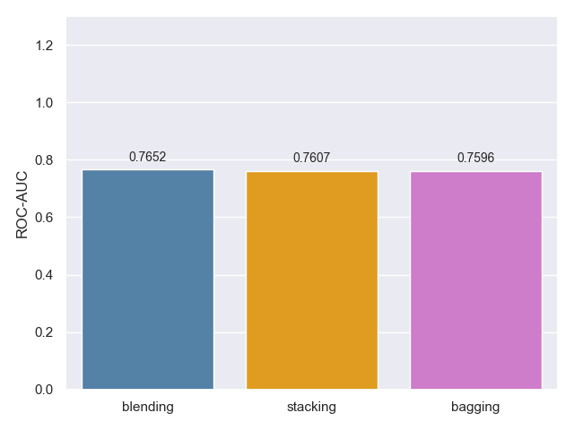
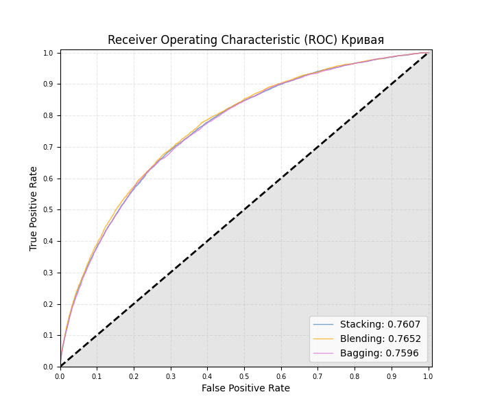
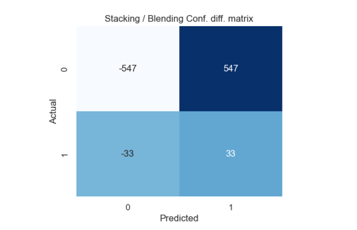
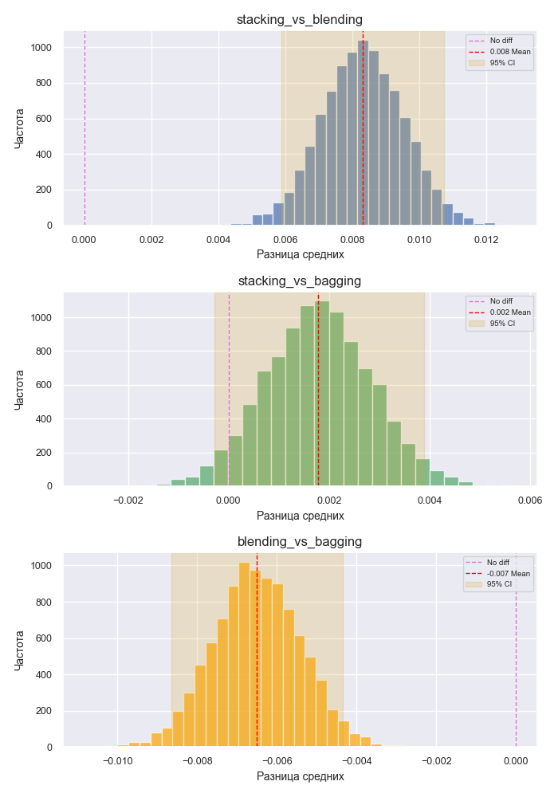
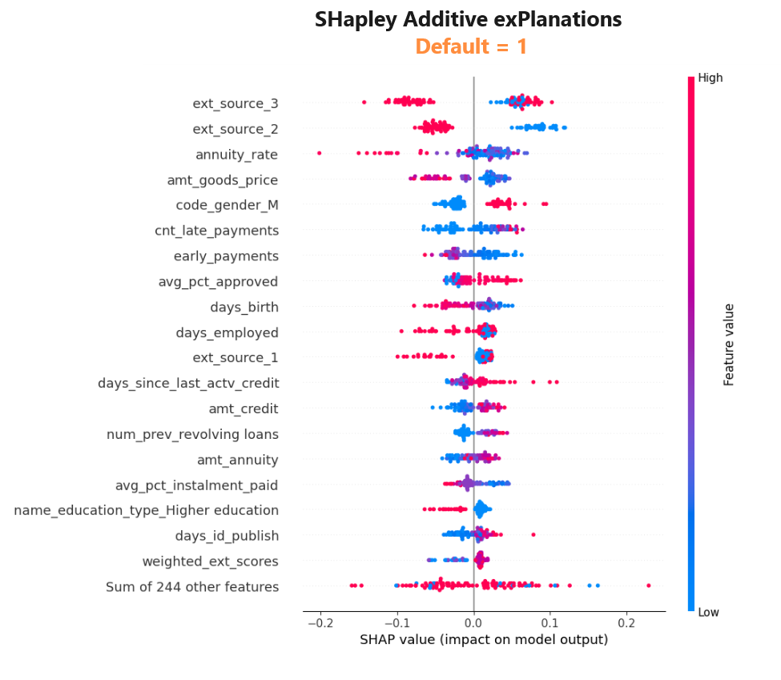

# Сравнительный анализ ансамблевых моделей
## Значения ROC-AUC 

- Самый высокий ROC-AUC имеет ансамблевая модель "blending".
- Модели "stacking" и "bagging" имеют примерно одинаковые значения ROC-AUC

Данный факт может быть связан с тем, что я подбирал параметры для базовых и мета моделей
"blending" и "bagging" с помощью Optuna, в то время как подобрать параметры для модели "stacking" для
меня оказалось технически не возможно.  
Оттуда и разница в скоре, скорее всего.

## Площадь под кривой ROC-AUC

Все три модели показывают довольно неплохой (и одинаковый) результат.

## Разница в предсказаниях моделей "stacking" и "blending"
Посмотрим в чём заключается разница в предсказаниях моделей.  
Для этого построим матрицы сопряжённости для каждой модели и посчитаем разницу между ними.

- Модель "stacking" имеет на 33 больше верных предсказаний для позитивного класса (дефолт) чем у "blending". Что составлет **0.6%** от всего количества наблюдений позитивного класса.
- Модель "stacking" иммет на 547 меньше верных предсказаний для негативного класса (не дефолт) чем у "blending". Что составляет **1%** от всего количества наблюдения негативного класса.

Что и подтверждает более высокое значение ROC-AUC у "blending" модели, по сравнению с моделью "stacking".  
Хоть разница и имеется, но она настолько мала, что есть вероятность того, что она не является статистически значимой.  

Проверим гипотезу о том, что предсказания моделей "stacking" и "blending" имеют статистически значимые различия, с помощью метода **Bootstrap**.

## Определение статистической значимости разницы между предсказаниями моделей.

Для этого воспользуемся методом Bootstap.  

Будем тестировать разницу между средними предсказаниями вероятности для позитивного класса моделями.

- **Наибольшая разница**: Наибольшая разница в предсказаниях вероятности позитивного класса наблюдается между моделями "stacking" и "bagging" и между моделями "blending" и "bagging".
- **Наименьшая разница**: Наименьшая разница в предсказаниях вероятности позитивного класса наблюдается между моделями "stacking" и "bagging"

Когда значение **0 не входит в 95% доверительный интервал** для разницы в средних предсказаниях вероятности положительного класса, это указывает на то, что различия в предсказаниях моделей для положительного класса статистически значимы. И наоборот.

Это означает, что разница в предсказаниях моделей вероятности для положительного класса **не случайна**, а представляет собой реальные и статистически значимые различия.  

- **Присутствует** статистически значимая разница между предсказаниями вероятности дефолта между моделями "stacking" и "blending".
- **Присутствует** статистически значимая разница между предсказаниями вероятности дефолта между моделями "blending" и "bagging".
- **Отсутствует** статистически значимая разница между предсказаниями вероятности дефолта между моделями "stacking" и "bagging"

<u>Таким образом, несмотря на минимальные различия в средних вероятностях положительного класса, доверительные интервалы указывают на статистическую значимость этих различий у моделей</u> ("stacking" и "blending") и ("blending" и "bagging").

## Анализ значимости признаков при помощи SHapley values.

Анализ важности признаков ансамблевых моделей - не самая тривиальная задача, с которой довольно хорошо справляется библиотека SHap.

Посмотрим на графике `beeswarm`, как признаки влияют на дачу предсказаний моделью.

На графике изображено то, как значение признака влияет на предсказания модели (в нашем случае - предсказания позитивного класса, дефолта).
- Если значения изображены справа от центральной оси - значит они (их значения) "сдвигают" предсказания в сторону увеличения вероятности дефолта.
- Если значения изображены справа от центральной оси, то они "сдвигают" предсказания в сторону уменьшения вероятности дефолта.

Так же признаки имеют цвет от синего до красного, что обозначает величину значения признака.

Данный график просто переполнен инсайтами и порой - неожиданными, например:
- `code_gender_M`: синего цвета сдвигает предсказания сильно в сторону уменьшения вероятности дефолта. Иначе говоря: синий цвет - минимальное значение, признак бинарный, значит это ноль (0). Таким образом, по мнению модели, пол заёмщика сильно влияет на вероятность дефолта.

Ну и из очевидного:
- `days_employed`: чем выше значение, а значит - чем больше трудовой стаж - тем ниже вероятность дефолта.
- `days_birth`: чем старше человек, тем меньше для него вероятность дефолта.
- `higher_education`: люди с высшим образованиям менее склонны к невыплатами  
... и так далее

Основной итог оценки важности признаков: Самыми важными для прогнозирования дефолта оказались **ext_source_1 (2,3)** – закодированные признаки полученные (видимо купленные) из внешних источников.  
Знания - сила (и деньги).  

Дополнительные признаки сгенерированные нами ранее улучшили предсказательную способность модели.
- Даже такой признак как `name_education_Higher_education`, <u>который был получен в ходе One-Hot Encoding</u> (по необходимости), был сильно оценён моделью (оказался важен) и внес значительный вклад в улучшение предсказательной способности модели.

# Итог

1. Нужно лучше (или и вовсе) обучать "stacking" ансамбли и составлять их из гетерогенных моделей, чтобы они не давали предсказания аналогичные простому усреднению предсказаний нескольких моделей.
2. Затюненный "bagging" ~= "stacking" на минималках.
3. Кажется, логистическая регрессия - не самый лучший выбор для мета модели над деревьями в задаче классификации. DNN, скорее всего, покажет значительно лучший результат.
4. Даже в ходе предобработки данных (как с Ohe-Hot Encoding) - можно *случайно* получить значимые признаки.
5. Генерация дополнительных признаков - один из главных компонентов эффективной модели.
6. Bootstrapping - интуитивно понятный, гибкий и очень мощный статистический инструмент.
7. SHAP values - хранят много инсайтов для бизнеса.
